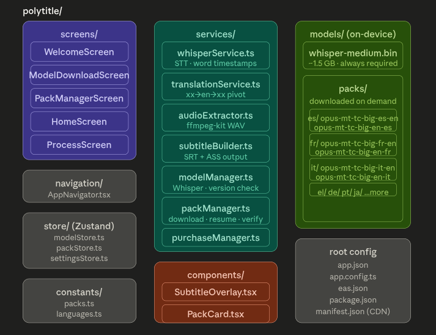
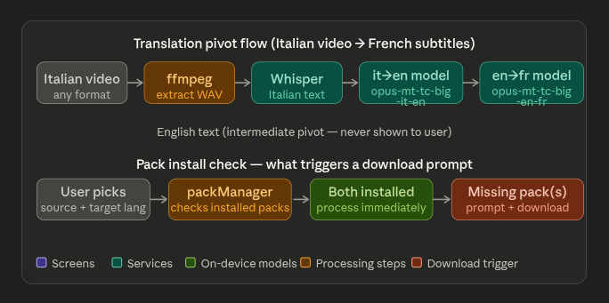
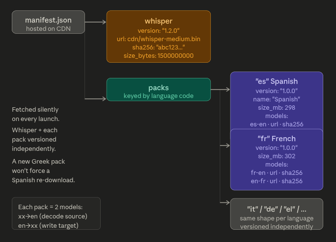
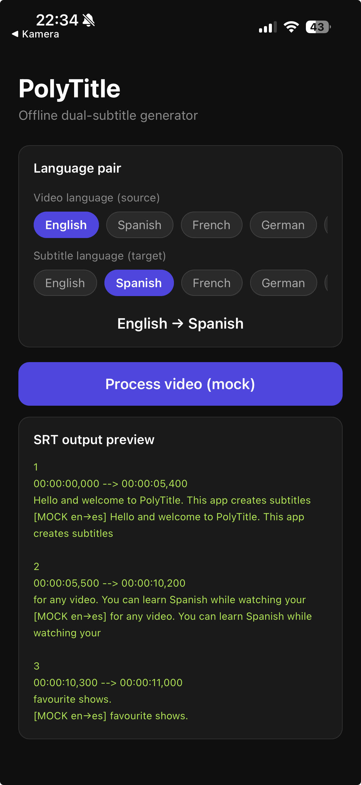

# PolyTitle

**Offline dual-subtitle generator for iOS and Android.**

Pick any video, choose a source and target language, and PolyTitle transcribes the speech and translates it — entirely on-device, with no internet connection required after the initial model download. No subscriptions, no API keys, no ongoing cost.

> Built with React Native (Expo → bare workflow), Whisper (speech-to-text), and Helsinki-NLP Opus-MT models (translation).

---

## How it works

PolyTitle uses English as a translation pivot, which means any language pair is supported from a small library of per-language model files:

```
Italian video → [Whisper] → Italian text
             → [it→en model] → English text  (internal, never shown to user)
             → [en→fr model] → French subtitles
```

Users download only the language packs they need. Each pack is ~300 MB and covers both directions for that language (e.g. the French pack handles both French source videos and French as a target language).

---

## Features

- Transcribes speech using OpenAI Whisper medium (on-device, ~1.5 GB, downloaded once on first launch)
- Translates between any two supported languages via English pivot
- 14+ language packs available at launch, each ~300 MB, downloaded on demand
- Exports `.srt` dual subtitles (original + translation on each line)
- Exports `.ass` karaoke subtitles with per-word highlight timing
- Built-in video player with live subtitle overlay
- Pack manager — browse, download, and update language packs independently
- Whisper and each language pack versioned and updated independently
- One-time purchase, no subscription

---

## Schema




---

## Core screen
   

---

## Tech stack

| Layer | Library |
|---|---|
| Framework | React Native (Expo managed → bare workflow) |
| Speech-to-text | `whisper.rn` (Whisper medium, on-device) |
| Translation | `react-native-executorch` (Opus-MT ONNX, on-device) |
| Audio extraction | `ffmpeg-kit-react-native` |
| Video playback | `react-native-video` |
| State management | `zustand` |
| In-app purchase | `react-native-iap` |
| File system | `expo-file-system` |
| Secure storage | `expo-secure-store` |

---

## Translation models

All translation models are from [Helsinki-NLP Opus-MT](https://github.com/Helsinki-NLP/Opus-MT), licensed under **Apache 2.0** — fully free for commercial use, no attribution required in the UI.

Whisper is licensed under **MIT**.

No model is bundled in the app binary. Whisper is downloaded on first launch (~1.5 GB). Language packs are downloaded on demand when the user first selects that language pair.

### Supported language packs

| Code | Language | Size |
|---|---|---|
| `es` | Spanish | ~298 MB |
| `fr` | French | ~302 MB |
| `de` | German | ~298 MB |
| `it` | Italian | ~298 MB |
| `pt` | Portuguese (EU + BR) | ~300 MB |
| `ja` | Japanese | ~305 MB |
| `ko` | Korean | ~298 MB |
| `zh` | Chinese (simplified + traditional) | ~302 MB |
| `ru` | Russian | ~300 MB |
| `nl` | Dutch | ~298 MB |
| `el` | Greek | ~296 MB |
| `pl` | Polish | ~298 MB |
| `ar` | Arabic | ~300 MB |
| `tr` | Turkish | ~298 MB |

Any combination of the above works as a pair — Italian → Greek, Spanish → Japanese, French → Arabic, and so on. The user needs both the source language pack and the target language pack installed.

---

## Project structure

```
polytitle/
├── screens/
│   ├── WelcomeScreen.tsx          # First-launch intro
│   ├── ModelDownloadScreen.tsx    # Whisper download + progress UI
│   ├── PackManagerScreen.tsx      # Browse, download, update language packs
│   ├── HomeScreen.tsx             # Video picker + language pair selector
│   ├── ProcessScreen.tsx          # Transcription + translation progress
│   └── PlayerScreen.tsx           # Video player with subtitle overlay
│
├── services/
│   ├── whisperService.ts          # STT via whisper.rn, word timestamps
│   ├── translationService.ts      # xx→en→xx pivot via Opus-MT
│   ├── audioExtractor.ts          # WAV extraction via ffmpeg-kit
│   ├── subtitleBuilder.ts         # Segment regroup, SRT + ASS generation
│   ├── modelManager.ts            # Whisper download, versioning, update checks
│   ├── packManager.ts             # Language pack download, resume, verify, update
│   ├── fileExporter.ts            # Write SRT/ASS to device storage
│   └── purchaseManager.ts         # One-time IAP unlock
│
├── components/
│   ├── SubtitleOverlay.tsx        # Dual subtitle renderer over video
│   ├── PackCard.tsx               # Language pack UI card (install/update/delete)
│   ├── ProgressCard.tsx           # Processing step progress UI
│   └── LanguagePicker.tsx         # Source + target language selector
│
├── store/
│   ├── modelStore.ts              # Whisper status + update state
│   ├── packStore.ts               # Installed packs, download progress
│   └── settingsStore.ts           # User preferences
│
├── constants/
│   ├── packs.ts                   # Pack definitions, model URLs, sizes
│   ├── languages.ts               # Language code → display name map
│   └── config.ts                  # CDN base URL, app constants
│
├── navigation/
│   └── AppNavigator.tsx           # Stack navigator + launch model check
│
├── app.json                       # Expo config
├── app.config.ts                  # Dynamic Expo config
├── eas.json                       # EAS build profiles
└── package.json
```

---

## Model versioning

A `manifest.json` file hosted on a CDN is fetched silently on every app launch. Whisper and each language pack are versioned independently — a French model update does not trigger a Spanish re-download.

```json
{
  "whisper": {
    "version": "1.2.0",
    "url": "https://your-cdn.com/models/whisper-medium.bin",
    "sha256": "abc123...",
    "size_bytes": 1500000000
  },
  "packs": {
    "es": {
      "version": "1.0.0",
      "name": "Spanish",
      "size_mb": 298,
      "models": [
        { "direction": "es-en", "url": "https://your-cdn.com/packs/es/es-en.onnx", "sha256": "..." },
        { "direction": "en-es", "url": "https://your-cdn.com/packs/es/en-es.onnx", "sha256": "..." }
      ]
    },
    "fr": {
      "version": "1.0.0",
      "name": "French",
      "size_mb": 302,
      "models": [
        { "direction": "fr-en", "url": "https://your-cdn.com/packs/fr/fr-en.onnx", "sha256": "..." },
        { "direction": "en-fr", "url": "https://your-cdn.com/packs/fr/en-fr.onnx", "sha256": "..." }
      ]
    }
  }
}
```

Downloads are resumable and verified by SHA-256 checksum. Files are written to a `.tmp` path first and atomically swapped to the final path only on successful verification — a failed download never corrupts a working model.

### On-device storage layout

```
DocumentDirectory/
├── models/
│   └── whisper-medium.bin         # Always required, ~1.5 GB
└── packs/
    ├── es/
    │   ├── es-en.onnx             # Spanish → English
    │   └── en-es.onnx             # English → Spanish
    ├── fr/
    │   ├── fr-en.onnx
    │   └── en-fr.onnx
    └── el/
        ├── el-en.onnx
        └── en-el.onnx
```

---

## Getting started

### Prerequisites

- Node.js 18+
- Expo CLI: `npm install -g expo`
- For iOS: Xcode 15+, CocoaPods
- For Android: Android Studio, JDK 17

### Project setup

```bash
# 1. Install all dependencies
npm install \
  whisper.rn \
  react-native-executorch \
  ffmpeg-kit-react-native \
  react-native-video \
  react-native-iap \
  react-native-document-picker \
  @react-native-async-storage/async-storage \
  expo-file-system \
  expo-secure-store \
  expo-dev-client \
  zustand

# 2. Install dev client for native module support
npx expo install expo-dev-client

# 3. Run on device / simulator
npx expo run:ios
npx expo run:android
```
---

## Ejecting to bare workflow (for App Store / Play Store)

```bash
# Generate native ios/ and android/ folders
npx expo prebuild --platform ios
npx expo prebuild --platform android

# Then use React Native CLI directly
npx react-native run-ios
npx react-native run-android
```

### EAS Build (recommended for store distribution)

```bash
npm install -g eas-cli
eas login
eas build --platform ios --profile production
eas build --platform android --profile production
```

---

## Converting Opus-MT to ONNX

Opus-MT models are distributed in PyTorch/Marian format. Convert to ONNX once on a desktop machine, then host the output on your CDN.

```bash
pip install transformers optimum onnx onnxruntime

# Export to ONNX
python -c "
from optimum.exporters.onnx import main_export
main_export(
    model_name_or_path='Helsinki-NLP/opus-mt-tc-big-es-en',
    output='./onnx/es-en',
    task='translation'
)
"

# Quantize to int8 (~75% size reduction, minimal quality loss)
python -c "
from onnxruntime.quantization import quantize_dynamic, QuantType
quantize_dynamic(
    'onnx/es-en/model.onnx',
    'onnx/es-en/model-int8.onnx',
    weight_type=QuantType.QInt8
)
"
```

Repeat for each language direction (`es-en`, `en-es`, `fr-en`, `en-fr`, etc.), then upload to your CDN and add each entry to `manifest.json`.

---

## Subtitle output formats

### SRT (dual subtitles)

```
1
00:00:01,200 --> 00:00:03,800
Ciao, come stai oggi?
Hello, how are you today?
```

### ASS (karaoke with per-word highlight)

```
Dialogue: 0,0:00:01.20,0:00:03.80,Default,{\k40}Cia{\k30}o, {\k50}co{\k40}me ...
```

Each `{\k<duration>}` tag highlights that word in sync with the speech.

---

## Roadmap

- [ ] Subtitle editor (tap a segment to correct it)
- [ ] Burned-in subtitle export via ffmpeg
- [ ] Batch processing (queue multiple files)
- [ ] Whisper large-v3 option (higher accuracy, larger download)
- [ ] Custom subtitle font, size, and colour settings
- [ ] iCloud / Google Drive export

---

## License

MIT — see [LICENSE](LICENSE).

**Models:**
- Whisper (OpenAI) — [MIT](https://github.com/openai/whisper/blob/main/LICENSE)
- Opus-MT (Helsinki-NLP) — [Apache 2.0](https://github.com/Helsinki-NLP/Opus-MT) — free for commercial use

---

## Acknowledgements

- [OpenAI Whisper](https://github.com/openai/whisper)
- [Helsinki-NLP Opus-MT](https://github.com/Helsinki-NLP/Opus-MT)
- [whisper.rn](https://github.com/mybigday/whisper.rn)
- [react-native-executorch](https://github.com/software-mansion/react-native-executorch)
- [ffmpeg-kit](https://github.com/arthenica/ffmpeg-kit)
- [react-native-video](https://github.com/TheWidlarzGroup/react-native-video)